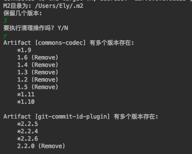

# Clean Maven Repository

清理本地maven仓库, 移除旧版本jar包, 节省磁盘空间

可以选择保留几个版本, 清理后, 程序没有删除jar包.  而是移动到了~/.m3目录. 之后也可以恢复. 或者删除操作.

# 注意
移除旧版本Jar包操作, 目前逻辑为: 
1. 如果版本号符合Maven版本号规范则根据版本号来
2. 如果版本号为: 1, 1.2, 1.2.3  自动补齐版本进行比较
3. 其它不规范的版本根据文件的LastModifiedTime来比较
 
(误删除的可能就需要重新下载了~ 反正也是IDE下载~~ O(∩_∩)O哈哈~)